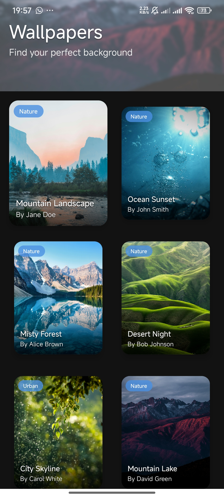
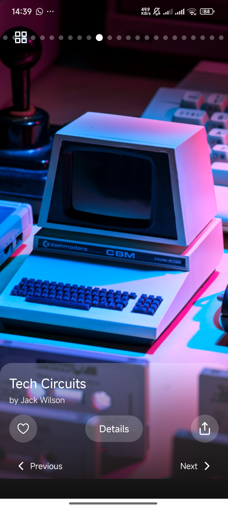
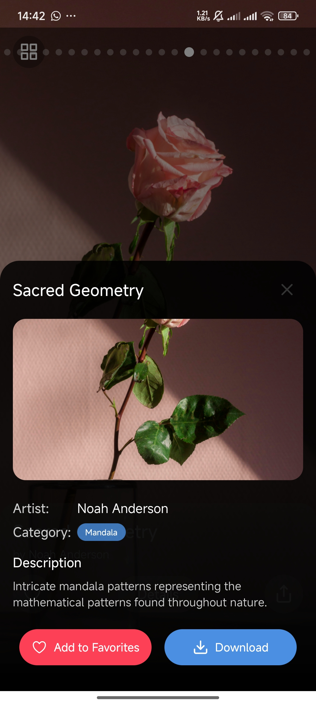

# WallMuse

WallMuse is a modern, Expo-based wallpaper application built with TypeScript. It allows users to explore a grid of wallpaper categories on the home screen and view images in a sleek horizontal swipe view filtered by category. Users can view detailed information for each wallpaper, mark favorites, share, and download images—all wrapped in a beautifully animated, dark-themed interface.






## Features

- **Categories Grid Home Screen:**  
  Browse a grid of unique wallpaper categories and tap a category to view related images.

- **Filtered Horizontal Swipe View:**  
  Once a category is selected, enjoy a full-screen horizontal swipe view of wallpapers filtered by that category.

- **Details Modal:**  
  View detailed information about each wallpaper—including title, author, description, and category—in a dark, transparent modal.

- **Favorites & Sharing:**  
  Mark wallpapers as favorites and share them easily.

- **Download Functionality:**  
  Download wallpapers with progress tracking to save them directly to your device.

- **Adaptive Back Navigation:**  
  On Android, pressing the hardware back button in swipe view returns you to the categories grid instead of exiting the app.

## Screenshots

*Add screenshots or animated GIFs here to show WallMuse in action on your device or emulator.*

## Installation

1. **Clone the Repository:**

```bash
git clone https://github.com/theotsori/WallMuse.git
cd WallMuse
```

2. **Install Dependencies:**

Ensure you have Node.js and the Expo CLI installed.

```bash
npm install
# or
yarn install
```

3. **Run the Application:**

```bash
npx expo start
```

Open the project in the Expo Go app on your device or use an emulator.

## Project Structure
```bash
WallMuse/
├── assets/
│   ├── icon.png                      # Application icon (1024x1024 recommended)
│   ├── adaptive-icon-foreground.png  # Adaptive icon foreground for Android
│   ├── adaptive-icon-background.png  # Adaptive icon background for Android
│   └── splash.png                    # Splash screen image
├── data/
│   └── samplewallpapers.ts           # Sample wallpaper data with enhanced properties
├── App.tsx                           # Main application file
├── app.json                          # Expo configuration file (icons, splash, etc.)
├── package.json
└── README.md
```

## Expo Configuration
Your app.json should include the necessary configuration for icons, adaptive icons, and the splash screen. For example:

```json
{
  "expo": {
    "name": "WallMuse",
    "slug": "wallmuse",
    "version": "1.0.0",
    "orientation": "portrait",
    "icon": "./assets/icon.png",
    "splash": {
      "image": "./assets/splash.png",
      "resizeMode": "contain",
      "backgroundColor": "#121212"
    },
    "android": {
      "adaptiveIcon": {
        "foregroundImage": "./assets/adaptive-icon-foreground.png",
        "backgroundImage": "./assets/adaptive-icon-background.png"
      }
    },
    "updates": {
      "fallbackToCacheTimeout": 0
    },
    "assetBundlePatterns": [
      "**/*"
    ],
    "ios": {
      "supportsTablet": true
    }
  }
}
```

## Usage

### Home Screen

**Categories Grid:**  
When the app starts, the home screen displays a grid of wallpaper categories derived from the sample data. Tap on a category to view wallpapers within that category.

### Swipe View

**Horizontal Swiping:**  
Once a category is selected, wallpapers are displayed in a horizontal swipe view. Swipe left or right to navigate through wallpapers.

**Back Navigation:**  
Use the back button (or tap the grid icon) to return to the home screen.

**Details Modal:**  
Tap the "Details" button on any wallpaper to see additional information in a dark transparent modal.

**Favorites & Sharing:**  
Mark a wallpaper as a favorite or share it directly from the swipe view.

### Downloading Wallpapers

Tap the "Download" button in the details modal to download the wallpaper to your device. The app shows download progress and saves the wallpaper to your gallery.

## Dependencies

- **Expo:** For building and running the app.
- **React Native:** Core framework.
- **TypeScript:** For static type checking.
- **expo-linear-gradient:** To render gradient overlays.
- **expo-blur:** For blur effects on backgrounds.
- **expo-media-library:** For saving images to the device.
- **expo-file-system:** For handling file downloads.
- **react-native-gesture-handler:** For handling gestures.
- **@expo/vector-icons:** For icons in the UI.

## Customization

**Changing Categories & Wallpapers:**  
You can update the wallpaper data in `data/samplewallpapers.ts` to include your own images, categories, and details.

**Styling:**  
Modify the styles in `App.tsx` under the `StyleSheet.create` call to adjust fonts, colors, and layout as per your design requirements.

## Contributing

Contributions are welcome! Please open an issue or submit a pull request if you have suggestions or improvements.

## License

This project is licensed under the MIT License. See the `LICENSE` file for details.

---

Happy coding and enjoy your new Expo Wallpaper App!
